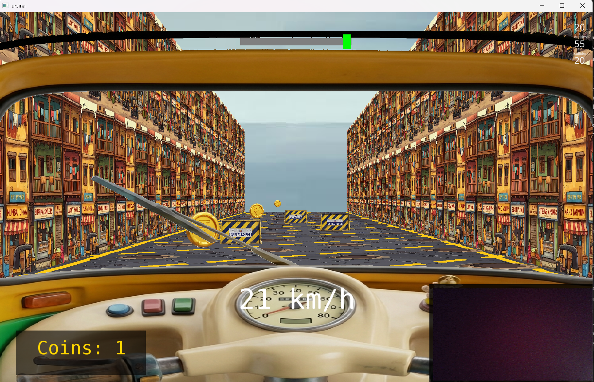

# Mumbai Roads

A high-speed, vision-controlled endless runner built with **Ursina Engine** and **OpenCV**.



## Features
- **Vision-Based Control**: Scale your movements in real-time using your webcam.
- **Dynamic Level Generation**: Procedurally generated segments with obstacles and pick-ups.
- **Cockpit-Style UI**: Immersive dashboard with real-time speed and motion feedback.
- **Progressive Difficulty**: Speed increases as you collect coins and survive longer.

## Controls
- **Motion (Webcam)**:
  - Move Left/Right in view to switch lanes.
  - Jump physically to trigger an in-game jump.
- **Keyboard**:
  - `Left Arrow` / `Right Arrow`: Switch lanes.
  - `Up Arrow`: Jump.
  - `C`: Recalibrate vision system.
  - `R`: Restart game after Game Over.
  - `ESC`: Quit game.

## Installation

### Prerequisites
- Python 3.9+
- A working webcam

### Setup
1. Clone the repository.
2. Create and activate a virtual environment:
   ```bash
   python -m venv venv
   source venv/Scripts/activate  # Windows
   ```
3. Install dependencies:
   ```bash
   pip install -r requirements.txt
   ```

## Running the Game
Launch the game using:
```bash
python main.py
```

## Project Structure
- `main.py`: Entry point and main game loop.
- `game/`: Core game logic (Player, Level, Vision Bridge).
- `vision/`: Computer vision modules (Camera Feed, Motion Detector).
- `assets/`: 3D models and textures.
- `scripts/`: Utility and setup scripts.
